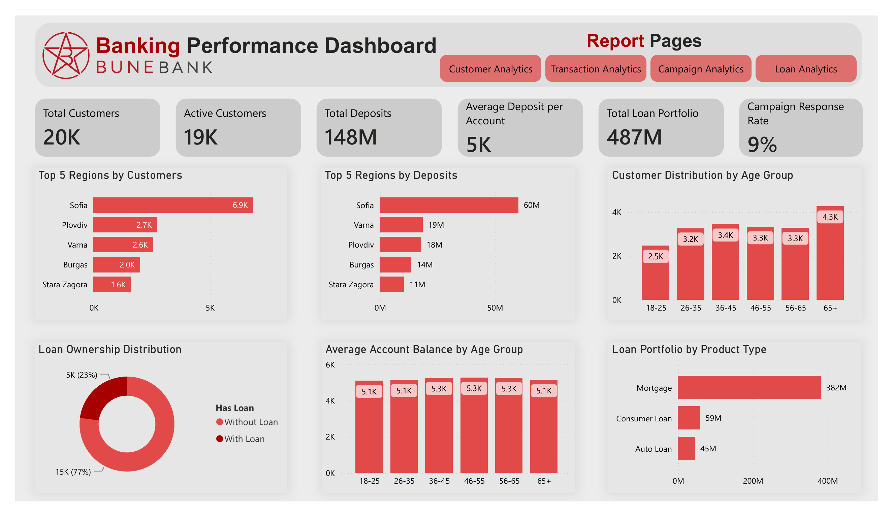
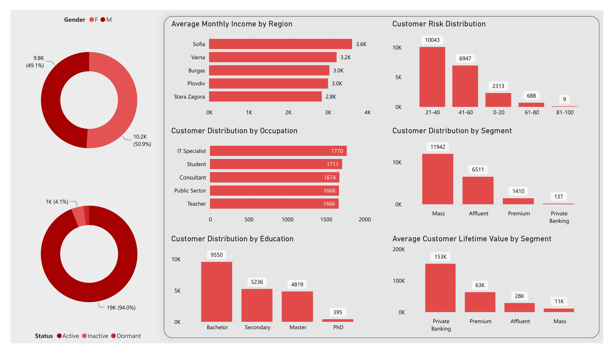
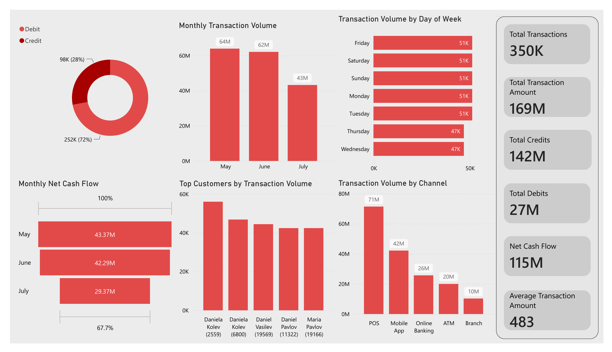
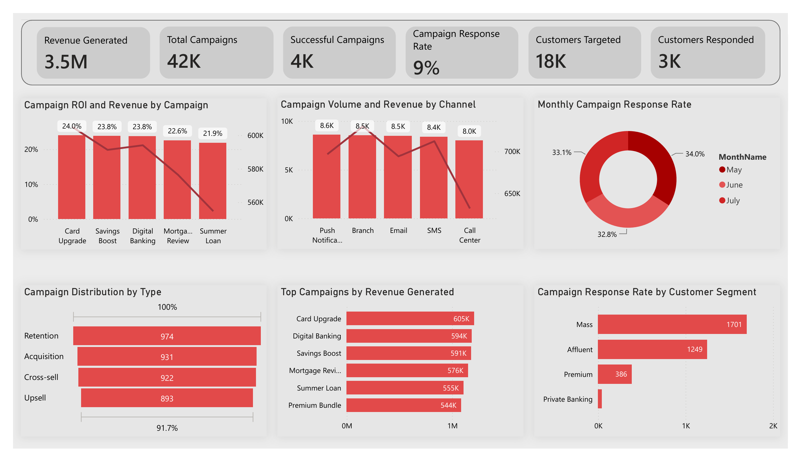
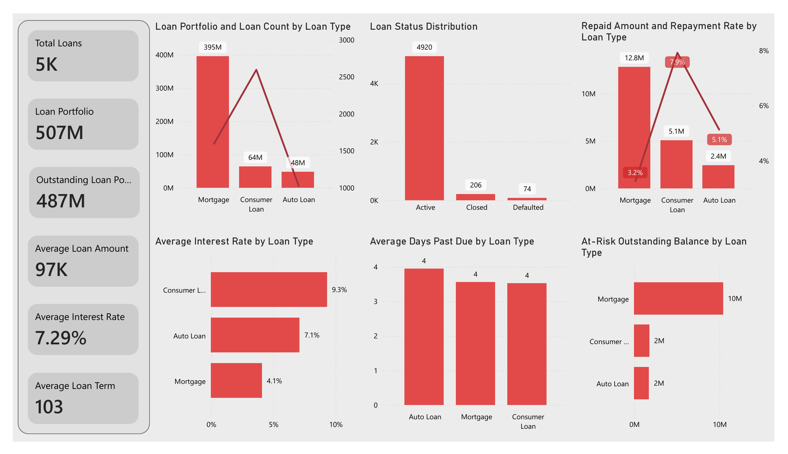

# BuneBank Business Intelligence Dashboard

## Overview

This project showcases an end-to-end Business Intelligence solution developed in **Power BI** for a fictional retail bank, **BuneBank**.

The dashboard provides executive-level insights into customer behavior, transaction activity, loan portfolio performance, and marketing campaign effectiveness.

---

## Dashboard Pages

- Executive Overview
- Customer Analytics
- Transaction Analytics
- Campaign Analytics
- Loan Analytics

---

## Technologies Used

- Power BI Desktop
- DAX
- Power Query
- Data Modeling (Star Schema)
- Microsoft Excel

---

## Key Features

- Multi-page interactive dashboard
- 40+ DAX measures and KPIs
- Star-schema data model
- Customer segmentation
- Loan portfolio analysis
- Transaction monitoring
- Campaign performance analysis
- Executive reporting

---

## Dataset

Synthetic banking dataset containing approximately:

- 20,000 Customers
- 28,500 Accounts
- 350,000 Transactions
- 5,200 Loans
- 42,000 Marketing Campaigns

---

## Dashboard Preview

## Executive Overview

## Customer Analytics

## Transaction Analytics

## Campaign Analytics

## Loan Analytics

---

## Repository Contents

- `BuneBank_Banking_Performance_Dashboard.pbix`
- Dashboard screenshots
- Documentation
