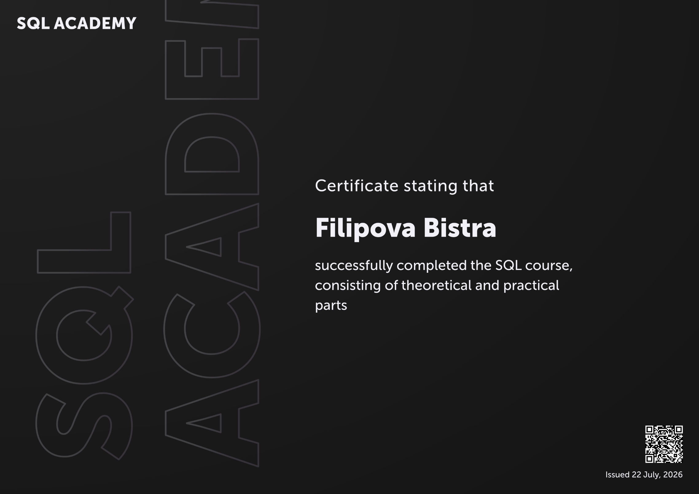

# SQL Academy Certificate

Issued: July 22, 2026

Successfully completed the SQL Academy course covering:

- Relational databases
- SQL querying
- JOINs
- Subqueries
- Common Table Expressions (CTEs)
- Window functions
- Data manipulation (INSERT, UPDATE, DELETE)
- Transactions
- Stored procedures
- Views
- Indexes
- Constraints

## SQL Certificate

  

> Click the certificate to view the full PDF.
